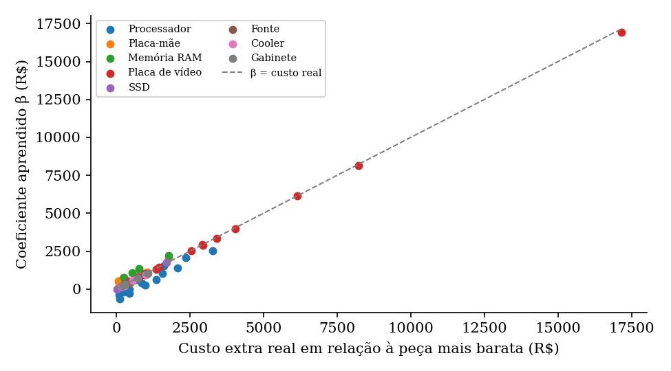

# 🖥️ PC Gamer Price Predictor

Estimativa do preço (R$) de um computador gamer a partir dos seus 8 componentes, comparando
**Regressão Linear Múltipla** e **K-Vizinhos Mais Próximos (KNN)** com scikit-learn.

Projeto Final da disciplina de **Machine Learning Clássico** · Engenharia de Computação ·
Centro Universitário UniSATC · 2026

[](https://colab.research.google.com/github/Loren1z9o/Price-Predictory-Hardware-/blob/main/PC_Gamer_Price_Predictor.ipynb)

---

## Resultados

| Modelo | MAE validação | MAE teste | R² teste | MAPE teste |
|---|---|---|---|---|
| **Regressão Linear** 🏆 | R$ 511 | **R$ 467** | **0,991** | **4,0%** |
| KNN (K = 11, pesos por distância) | R$ 1.510 | R$ 1.404 | 0,899 | 11,5% |
| Baseline (média do treino) | R$ 5.302 | R$ 5.211 | 0,000 | 59,9% |

O baseline (`DummyRegressor`) prevê sempre a média do treino e serve de piso: a Linear reduz o MAE em 90% em relação a ele.
O modelo foi escolhido pelo MAE de **validação**, e o conjunto de **teste** foi usado uma única vez, depois da escolha.

**Por que a Linear venceu:** o preço de um PC é aditivo, a soma das peças, e é exatamente essa a forma
que a Regressão Linear assume. Os coeficientes aprendidos recuperam o preço de cada peça do catálogo,
e o MAPE de 4,0% está no piso imposto pela variação de mercado de ±8% dos dados.
O KNN fica atrás porque a sua distância mede *quantas* peças são diferentes, não *quanto* elas custam.

<p align="center">
  <br>
  <em>Coeficientes aprendidos pela Linear × custo real das peças</em>
</p>

---

## Como executar

**Opção 1 · Google Colab (sem instalar nada):** clique no botão *Abrir no Colab* acima e use
*Ambiente de execução → Executar tudo*. O notebook roda o pipeline completo, célula por célula,
com as provas de funcionamento dos dois modelos.

**Opção 2 · Local** (requer **Python 3.10+**):

```bash
git clone https://github.com/Loren1z9o/Price-Predictory-Hardware-.git
cd Price-Predictory-Hardware-
pip install -r requirements.txt

python -m streamlit run app_streamlit.py   # interface web
python pc_gamer_ml.py                      # métricas no terminal + gera dados.json
```

O treino completo leva cerca de 10 segundos e é reprodutível (semente fixa 42).

### A interface

| Aba | Conteúdo |
|---|---|
| 🎯 **Preditor** | Monte um PC compatível (socket e DDR filtrados) e veja a estimativa dos dois modelos |
| 📊 **Resultados** | Métricas, real × previsto, resíduos e EDA do treino |
| 📘 **Teoria** | Prova, com a sua build, como cada modelo calcula o preço: a soma β₀ + Σβ da Linear e os K vizinhos do KNN, ambos batendo com o `model.predict()` |

---

## O dataset

O arquivo [`dataset_builds.csv`](dataset_builds.csv) traz as **3.000 builds** usadas no projeto, uma por linha:

| Coluna | Conteúdo |
| --- | --- |
| `cpu`, `mobo`, `ram`, `gpu`, `ssd`, `fonte`, `cooler`, `gabinete` | As 8 peças da build |
| `tier` | Faixa sorteada: entry, budget, mid, high ou enthusiast |
| `preco` | Preço da build em R$ (alvo da regressão) |

Ele é gerado pela função `gerar_dataset()` do `pc_gamer_ml.py`, com **semente fixa 42**: rodar o projeto
recria exatamente as mesmas builds, e o CSV é só uma cópia para consulta. Para regerá-lo:

```python
import pc_gamer_ml as ml
ml.gerar_dataset(3000).to_csv("dataset_builds.csv", index=False)
```

> O CSV contém o dataset inteiro, antes do split. A divisão em treino, validação e teste acontece
> dentro do pipeline, para que nenhuma análise use dados de validação ou de teste.

---

## Metodologia (sem vazamento de dados)

1. **Dados:** 3.000 builds geradas a partir de um catálogo de 72 peças com preços reais
   (hardwarebarato.com, KaBuM, Pichau, ago/2026; memórias RAM atualizadas em out/2026, após a alta de preços da DRAM). Preço = soma das peças × variação de mercado de ±8%.
2. **Split 70/15/15**, estratificado por faixa, feito **antes** de qualquer análise.
3. **EDA** somente no treino: 0 nulos e 114 outliers pelo IQR (mantidos, pois são builds enthusiast reais).
4. **One-Hot** dentro de `Pipeline` + `ColumnTransformer`, com fit só no treino:
   - Linear: `drop='first'` com categorias ordenadas por preço, então cada β é o custo extra da peça em R$;
   - KNN: One-Hot completo, então duas builds que diferem em *m* peças ficam à distância √(2m).
5. **KNN otimizado** com `GridSearchCV` (K de 1 a 30 × pesos, CV de 5 dobras no treino).
6. **Seleção** pelo MAE de validação e **teste usado uma única vez**.

---

## Estrutura

```
├── PC_Gamer_Price_Predictor.ipynb   # notebook Colab: pipeline completo passo a passo
├── dataset_builds.csv      # as 3.000 builds (gerado com semente 42)
├── pc_gamer_ml.py          # catálogo, geração dos dados, split, EDA, treino, avaliação
├── app_streamlit.py        # interface: abas Preditor e Resultados
├── tab_teoria.py           # aba Teoria: funcionamento e provas da Linear e do KNN
├── requirements.txt
└── relatorio/
    ├── Relatorio_PC_Gamer_Predictor_v7.docx   # relatório ABNT
    ├── gerar_figuras.py    # figuras e números do relatório, a partir do pipeline
    ├── build.js            # monta o .docx (Node.js + biblioteca docx)
    └── fig/                # figuras do relatório
```

Para regerar o relatório: `cd relatorio && python gerar_figuras.py && npm install docx && node build.js`

---

## Autores

**Lorenzo Sartori** · **João Gustavo** · **Lucas Rodrigues Vigarani**

Professor: Prof. Dr. Rodrigo Ramos Silva
